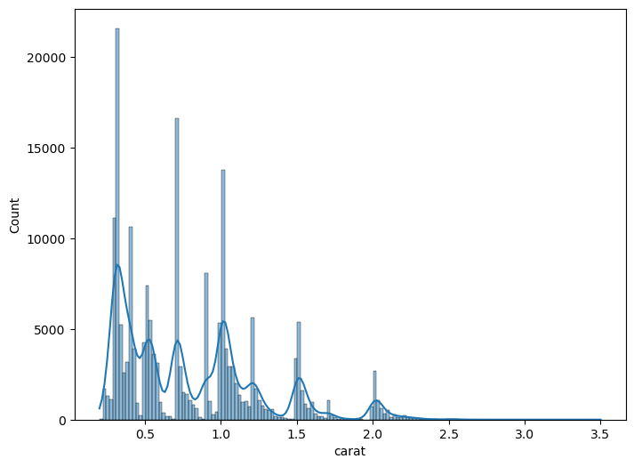
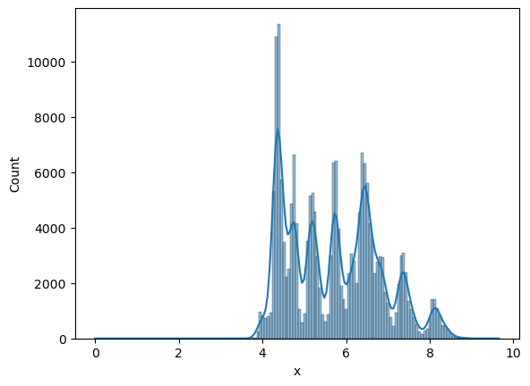
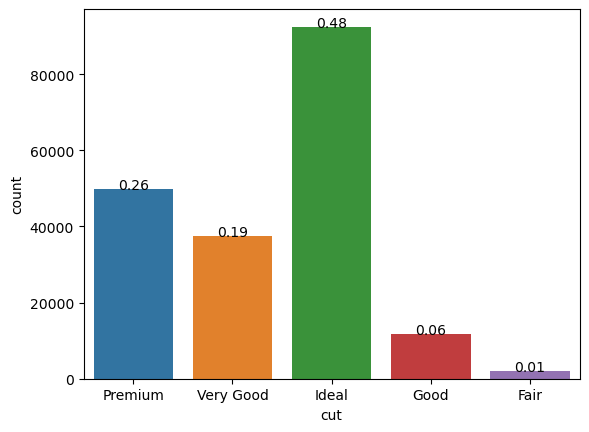
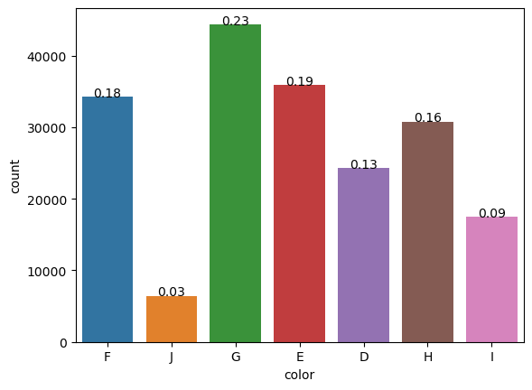
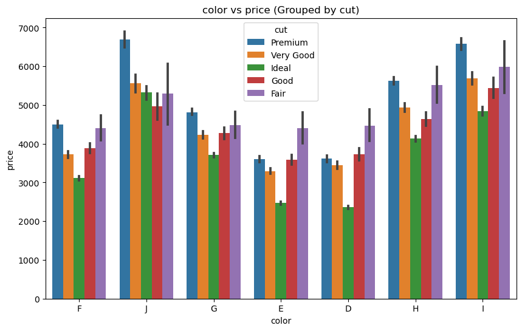
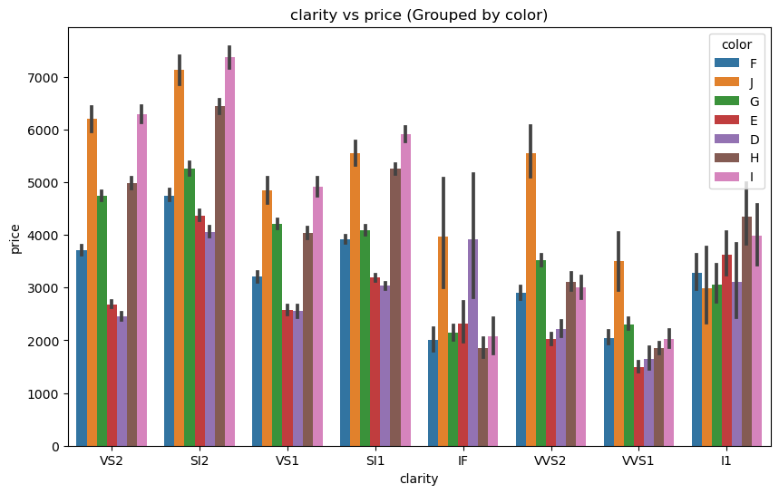
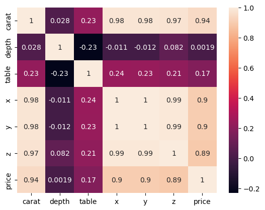
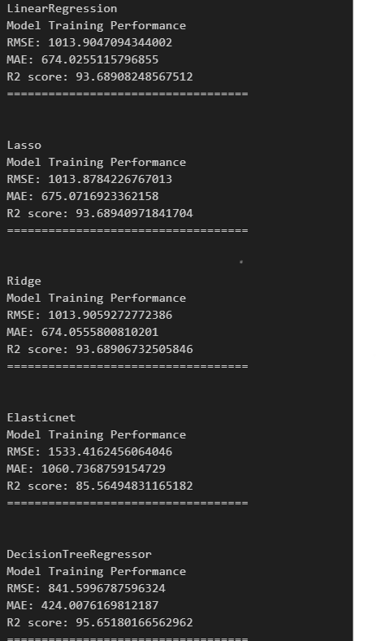
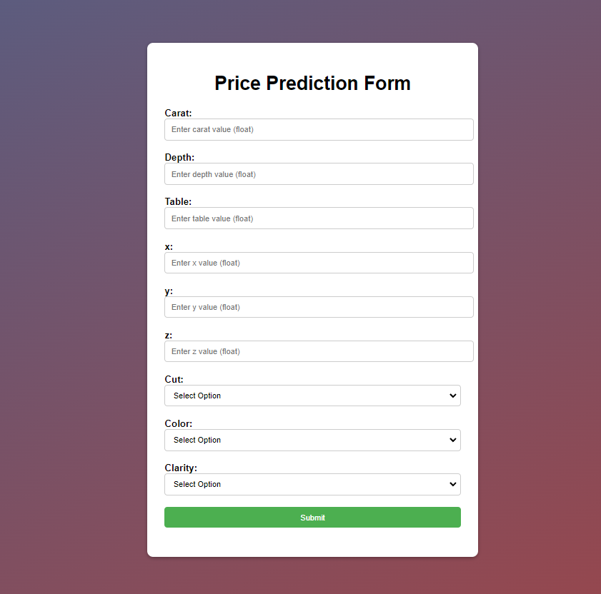

## Diamond Price Prediction

### Introduction About the Data :

**The dataset** The goal is to predict `price` of given diamond (Regression Analysis).

There are 10 independent variables (including `id`):

* `id` : unique identifier of each diamond
* `carat` : Carat (ct.) refers to the unique unit of weight measurement used exclusively to weigh gemstones and diamonds.
* `cut` : Quality of Diamond Cut
* `color` : Color of Diamond
* `clarity` : Diamond clarity is a measure of the purity and rarity of the stone, graded by the visibility of these characteristics under 10-power magnification.
* `depth` : The depth of diamond is its height (in millimeters) measured from the culet (bottom tip) to the table (flat, top surface)
* `table` : A diamond's table is the facet which can be seen when the stone is viewed face up.
* `x` : Diamond X dimension
* `y` : Diamond Y dimension
* `x` : Diamond Z dimension

Target variable:
* `price`: Price of the given Diamond.

Dataset Source Link :
[https://www.kaggle.com/competitions/playground-series-s3e8/data?select=train.csv](https://www.kaggle.com/competitions/playground-series-s3e8/data?select=train.csv)

<br>

### Setting up Project Environment :

This project is a separate project using Conda of Anaconda. It provides a clear structure for organizing your code and dependencies using a virtual environment. The project includes the following folders and files:

- artifacts/: This folder is used to store any generated artifacts, such as trained models or processed datasets.
- logs/: This folder is used to store log files generated by the application.
- Notebooks/: This folder is used to store Jupyter notebooks for data exploration or experimentation.
- src/: This folder contains the source code of your project.
- templates/: This folder is used to store HTML templates for your Flask application.
- environment/: This folder is used to store the virtual environment created by Conda.
- .gitignore: This file specifies which files and folders should be ignored by Git.
- application.py: This is the main Flask application file.
- setup.py: This file contains the configuration for packaging your project as a Python package.

#### Getting Started

To set up the project, please follow the instructions below:

##### Prerequisites

- Anaconda or Miniconda should be installed on your system.
- Installation
- Clone the project repository:
```
git clone <repository_url>
cd <project_directory>
```

- Create a new Conda environment for the project:
```
conda create --name <env_name> python=3.9
```
- Activate the newly created environment:
```
conda activate <env_name>
```
- Install the project dependencies:

```
pip install -r requirements.txt
```
- Running the Application

Make sure you are in the project directory and the Conda environment is activated.

#### Start the Flask application:

```
'python application.py' 

```
Open a web browser and visit http://localhost:5000 to access the application.

#### Additional Notes

- Having a separate project environment, such as the one created with Conda, offers several advantages:

- Dependency Isolation: By creating a virtual environment, you can install project-specific dependencies without interfering with the system-wide Python installation or other projects on your machine.

- Reproducibility: The project environment ensures that all project contributors are using the same set of dependencies, making it easier to reproduce and share the project's results.

- Version Control: By including the virtual environment in your project repository, you can easily recreate the same environment on different machines or after a fresh clone of the repository.

- Package Management: Using setup.py allows you to define the project's dependencies and make it easier to package and distribute your project as a Python package.

- By following these instructions and organizing your project with a separate environment, you can maintain a clean and reproducible development environment while keeping your project dependencies isolated and well-managed.

<br>

## EDA & Business Implication

EDA stands for exploratory data analysis where we explore our data and grab insights from it. EDA helps us in getting knowledge in form of various plots and diagrams where we can easily understand the data and its features.

<br>
<br>
<br>
<br>
<br>
<br>
<br>

__Insights__ 

- Color with highest mean price: ('SI2', 'I')
- Color with lowest mean price: ('VVS1', 'E')
- Color with highest mean price: ('J', 'Premium')
- Color with lowest mean price: ('D', 'Ideal')

## Model Training with Feature Selection, Feature Engineering, and Outlier Detection

In this project, we aim to predict the price of a given dataset using machine learning models. Before training the models, we perform the following steps:

- Data Splitting: We split the dataset into training and testing sets. The training set is used to train the models, while the testing set is used to evaluate their performance.

- Feature Selection: We apply feature selection techniques to identify the most relevant features for our prediction task. This helps in reducing the dimensionality of the dataset and improving the model's performance.

- Feature Engineering: We perform feature engineering to transform the existing features or create new features that can provide more meaningful information to the models. This step aims to enhance the predictive power of the features.

- Outlier Detection: We detect and handle outliers in the dataset. Outliers can significantly affect the performance of the models, so it is crucial to identify and handle them appropriately.

__Once these preprocessing steps are completed, we proceed to train the machine learning models.__ The following models are included in our project:

- LinearRegression: Linear regression is a popular and simple regression model that fits a linear relationship between the features and the target variable.

- Lasso: Lasso regression is a linear regression model that incorporates L1 regularization. It can help in feature selection by shrinking the coefficients of less relevant features to zero.

- Ridge: Ridge regression is another linear regression model that uses L2 regularization. It helps in reducing multicollinearity and can improve the model's performance.

- ElasticNet: ElasticNet combines the benefits of both Lasso and Ridge regression by using a combination of L1 and L2 regularization. It can handle cases where there are correlated features and performs feature selection.

- DecisionTreeRegressor: Decision trees are non-linear models that can capture complex relationships between the features and the target variable. DecisionTreeRegressor is a tree-based regression model.

__After evaluating the performance of these models, we have selected the DecisionTreeRegressor as our final model due to its ability to capture non-linear relationships.__
<br>

<br>
<br>

To provide a user-friendly interface, we have integrated the model into a Flask application. The Flask application serves as the front-end of the project, allowing users to interact with the trained model and make predictions based on their inputs.

The Flask application can be accessed by running the application.py file. It provides a web interface where users can input the required features, and the model will predict the price based on the provided information.
<br>

<br>
<br>

Using Flask for the front-end enables a seamless integration of the machine learning model into a user-friendly web application, enhancing the usability and accessibility of the project.

By following the steps outlined above and utilizing Flask for the front-end, you can effectively train a model to predict prices, incorporating feature selection, feature engineering, outlier detection, and a user-friendly interface.

### AUTHOR
<hr>
<strong>Shehryar Gondal</strong>


You can get in touch with me on my LinkedIn Profile:<br>
 <a href = "https://linkedin.com/in/shehryar-gondal-data-analyst"></a>

You can also follow my GitHub Profile to stay updated about my latest projects:<br>
<a href = "https://github.com/ShehryarGondal1"></a>


If you liked the repo then kindly support it by giving it a star ⭐.
